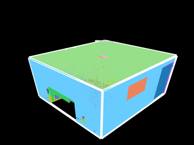
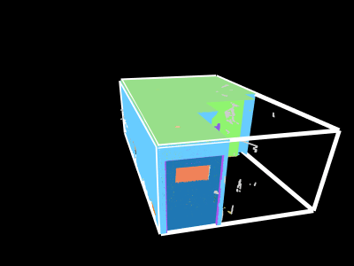
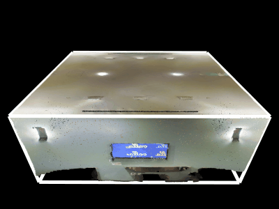
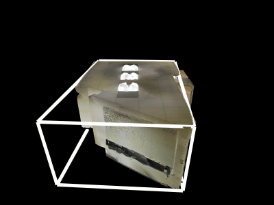

# Multi-view cuboid room layout estimation

This repository contains two datasets, based on [ScanNet++](https://kaldir.vc.in.tum.de/scannetpp/) and [2D-3D-Semantics](https://github.com/alexsax/2D-3D-Semantics), for benchmarking *multi-view cuboid room layout estimation*.

Each dataset consists of a set of *image tuples* and corresponding *ground truth cuboids*. We supply scripts to evaluate predicted room layouts against the ground truth.
  

*Given images with known camera poses captured inside a cuboid-shaped room the goal is to estimate the room layout.*

The datasets were created during the course of our work on the room layout estimation method [PixCuboid](https://github.com/ghanning/PixCuboid).

## Installation

Setup a virtual environment with the required Python packages:

```bash
virtualenv venv
source venv/bin/activate
pip install -r requirements.txt
```

## Dataset

### Images and camera poses

Download images and camera poses from the [ScanNet++](https://kaldir.vc.in.tum.de/scannetpp/) and [2D-3D-Semantics](https://github.com/alexsax/2D-3D-Semantics) web sites.

#### Perspective images (2D-3D-Semantics)

To be able to compare panorama and perspective based methods we supply a script to split the panorama images of 2D-3D-Semantics into four perspective views:

```bash
for area in area_1 area_2 area_3 area_4 area_5a area_5b area_6
do
  python -m mvc.pano_to_persp_2d3ds --root_dir ROOT_DIR --area $area
done
```

### Scenes

#### ScanNet++

The subset of cuboid-shaped scenes in ScanNet++ v2 have been split into training (391 scenes), validation (10 scenes) and test (18 scenes) sets according to the files [scenes_train.txt](dataset/scannetpp/scenes_train.txt), [scenes_val.txt](dataset/scannetpp/scenes_val.txt) and [scenes_test.txt](dataset/scannetpp/scenes_test.txt).

#### 2D-3D-Semantics

No data split has been performed for the cuboid-shaped scenes (also called "spaces") of 2D-3D-Semantics. The 160 scenes are listed in [scenes_all.txt](dataset/2d3ds/scenes_all.txt).

### Image tuples

#### ScanNet++

Each tuple consists of 10 randomly sampled DSLR images. For the training scenes 250 tuples were generated whereas the validation and test scenes each have 20 image tuples. The tuples can be found in the files [images_train.json](dataset/scannetpp/images_train.json), [images_val.json](dataset/scannetpp/images_val.json) and [images_test.json](dataset/scannetpp/images_test.json).

#### 2D-3D-Semantics

For each space there is one tuple with 2 panoramic and 8 corresponding perspective images, see [images_all.json](dataset/2d3ds/images_all.json).

### Ground truth cuboids

Ground truth cuboids for all scenes are available in [cuboids_train.json](dataset/scannetpp/cuboids_train.json), [cuboids_val.json](dataset/scannetpp/cuboids_val.json), [cuboids_test.json](dataset/scannetpp/cuboids_test.json) (ScanNet++) and [cuboids_all.json](dataset/2d3ds/cuboids_all.json) (2D-3D-Semantics).

The cuboids are parameterized by a rotation matrix $R$ and translation vector $t$ such that a point $x$ in scene coordinates is transformed to the cuboid's local frame via $Rx + t$. The size of the cuboid in the local frame is given by the size vector $s$.

## Evaluation

To evaluate your room layout estimation method run it on each image tuple and output a JSON file containing a list with one entry per tuple. An entry can either be a single layout prediction or a list of predictions. This is to support both multi-view methods (that make a single prediction per image tuple) and single-view methods (predicting one room layout per image in the tuple).

A layout prediction can be either:
- A cuboid, using the same format as in the ground truth cuboid files (keys: "R", "t", "s").
- A triangle mesh (keys: "faces", "verts").
- The path to a triangle mesh file that can be read with [MeshLib](https://meshlib.io).
  
If your method generates predictions using some other representation, for example a floor-level polygon with height, we suggest that you convert it into a mesh.

*Tip*: The script `generate_predictions.py` can be used to generate example room layout predictions for both ScanNet++ and 2D-3D-Semantics.

We offer two different scripts to run the evaluation, with different metrics as outlined below.

### 3D metrics

To compute the 3D Intersection-over-Union (IoU) and Chamfer distance between the predictions and the ground truth cuboids run

```bash
python -m mvc.evaluate --pred PRED --dataset {scannetpp,2d3ds} --split {train,val,test,all}
```

If the predictions are cuboids the script will also calculate the rotation error.

### Pixel-wise metrics

To render the predicted and ground truth room layouts in each view and compute per-pixel depth and normal angle errors use

```bash
python -m mvc.evaluate_pixel --root_dir ROOT_DIR --pred PRED --dataset {scannetpp,2d3ds} --split {train,val,test,all} [--num_images NUM_IMAGES]
```

If your predictions are based only on a subset of the images in each tuple (e.g. you used the first 5 images out of the 10 for ScanNet++) specify this with the `--num_images` argument.

*Note*: The script assumes that the ScanNet++ DSLR images have been undistorted, which can be done by the [ScanNet++ Toolbox](https://github.com/scannetpp/scannetpp?tab=readme-ov-file#undistortion-convert-fisheye-images-to-pinhole-with-opencv).

## Creating the datasets

Below we document the steps taken to create the two datasets. To run this code some additional dependencies are needed:

```bash
pip install -r requirements_extra.txt
```

### ScanNet++

<details>
<summary>Details</summary>
  
### Define paths

```bash
SCANNETPP_ROOT_DIR=<PATH TO SCANNET++ ROOT DIR>
SCANNETPP_DATASET_DIR=dataset/scannetpp
SCANNETPP_CUBOID_DIR=cuboids/scannetpp
```

### Cuboid fitting

For each scene a cuboid was fitted to the vertices of the semantic mesh classified as either "floor", "wall" or "ceiling".

```bash

for split in train val
do
  python -m mvc.fit_cuboids_scannetpp --root_dir $SCANNETPP_ROOT_DIR --split_path $SCANNETPP_ROOT_DIR/splits/nvs_sem_$split.txt --output_dir $SCANNETPP_CUBOID_DIR --output_split_path $SCANNETPP_DATASET_DIR/scenes_$split.txt
done
```

The script also outputs an initial list of scenes for which the cuboid fits well with the mesh, and animated renderings of the mesh vertices and the cuboid.

### Manual inspection

The GIF animations of all scenes in the preliminary lists were inspected manually. If the scene was determined not to be cuboid-shaped, or if the cuboid fitting had failed, it was removed from the list.



*✅ A cuboid-shaped scene.*



*❌ A scene that is not cuboid-shaped.*

This process resulted in a set of 391 training scenes (out of 856 in the existing ScanNet++ v2 training set) and 28 validation scenes (out of 50 in the existing validation set).

### Test split

A test split was created by taking two thirds of the scenes from the validation set.

```bash
shuf $SCANNETPP_DATASET_DIR/scenes_val.txt | split -l $(( $(wc -l <$SCANNETPP_DATASET_DIR/scenes_val.txt) * 2 / 3))
mv xaa $SCANNETPP_DATASET_DIR/scenes_test.txt
mv xab $SCANNETPP_DATASET_DIR/scenes_val.txt
```

### Ground truth cuboids

Ground truth cuboid files for the training, validation and test splits were generated as follows:

```bash
for split in train val test
do
  python -m mvc.compile_gt_cuboids --cuboid_dir $SCANNETPP_CUBOID_DIR --split_path $SCANNETPP_DATASET_DIR/scenes_$split.txt --output_path $SCANNETPP_DATASET_DIR/cuboids_$split.json
done
```

### Image sampling

Tuples of 10 DSLR images were sampled randomly for each scene:

```bash
NUM_IMAGES=10
python -m mvc.sample_images_scannetpp --root_dir $SCANNETPP_ROOT_DIR --split_path $SCANNETPP_DATASET_DIR/scenes_train.txt --num_images $NUM_IMAGES --num_tuples 250 --output_path $SCANNETPP_DATASET_DIR/images_train.json
python -m mvc.sample_images_scannetpp --root_dir $SCANNETPP_ROOT_DIR --split_path $SCANNETPP_DATASET_DIR/scenes_val.txt --num_images $NUM_IMAGES --num_tuples 20 --output_path $SCANNETPP_DATASET_DIR/images_val.json
python -m mvc.sample_images_scannetpp --root_dir $SCANNETPP_ROOT_DIR --split_path $SCANNETPP_DATASET_DIR/scenes_test.txt --num_images $NUM_IMAGES --num_tuples 20 --output_path $SCANNETPP_DATASET_DIR/images_test.json
```

</details>

### 2D-3D-Semantics

<details>
<summary>Details</summary>

### Define paths

```bash
_2D3DS_ROOT_DIR=<PATH TO 2D-3D-SEMANTICS ROOT DIR>
_2D3DS_DATASET_DIR=dataset/2d3ds
_2D3DS_CUBOID_DIR=cuboids/2d3ds
```

### Cuboid fitting

For each scene a cuboid was fitted to the points in the point cloud classified as either "floor", "wall" or "ceiling".

```bash
for area in area_1 area_2 area_3 area_4 area_5a area_5b area_6
do
  python -m mvc.fit_cuboids_2d3ds --root_dir $_2D3DS_ROOT_DIR --area $area --output_dir $_2D3DS_CUBOID_DIR --output_split_path $_2D3DS_DATASET_DIR/scenes_$area.txt
done
```

The script also outputs an initial list of scenes for which the cuboid fits well with the point cloud, and animated renderings of the point cloud and the cuboid.

### Manual inspection

The GIF animations of all scenes in the preliminary lists were inspected manually. If the scene was determined not to be cuboid-shaped, or if the cuboid fitting had failed, it was removed from the list.



*✅ A cuboid-shaped scene.*



*❌ A scene that is not cuboid-shaped.*

This process resulted in a total of 160 scenes for all areas combined, added to the file scenes_all.txt.

### Ground truth cuboids

A ground truth cuboid file was generated as follows:

```bash
python -m mvc.compile_gt_cuboids --cuboid_dir $_2D3DS_CUBOID_DIR --split_path $_2D3DS_DATASET_DIR/scenes_all.txt --output_path $_2D3DS_DATASET_DIR/cuboids_all.json
```

### Image sampling

Pairs of panorama images were sampled randomly for each scene:

```bash
python -m mvc.sample_images_2d3ds --root_dir $_2D3DS_ROOT_DIR --split_path $_2D3DS_DATASET_DIR/scenes_all.txt --cuboid_path $_2D3DS_DATASET_DIR/cuboids_all.json --num_panos 2 --output_path $_2D3DS_DATASET_DIR/images_all.json
```

</details>

## BibTex citation

If you use these datasets consider citing our work:

```
@inproceedings{hanning2025pixcuboid,
  title={{PixCuboid: Room Layout Estimation from Multi-view Featuremetric Alignment}},
  author={Hanning, Gustav and Åström, Kalle and Larsson, Viktor},
  booktitle={Proceedings of the IEEE/CVF International Conference on Computer Vision (ICCV) Workshops},
  year={2025},
}
```

Please also cite the original datasets:

```
@inproceedings{yeshwanthliu2023scannetpp,
  title={ScanNet++: A High-Fidelity Dataset of 3D Indoor Scenes},
  author={Yeshwanth, Chandan and Liu, Yueh-Cheng and Nie{\ss}ner, Matthias and Dai, Angela},
  booktitle = {Proceedings of the International Conference on Computer Vision ({ICCV})},
  year={2023}
}
```

```
@article{armeni2017joint,
  title={Joint 2d-3d-semantic data for indoor scene understanding},
  author={Armeni, Iro and Sax, Sasha and Zamir, Amir R and Savarese, Silvio},
  journal={arXiv preprint arXiv:1702.01105},
  year={2017}
}
```
